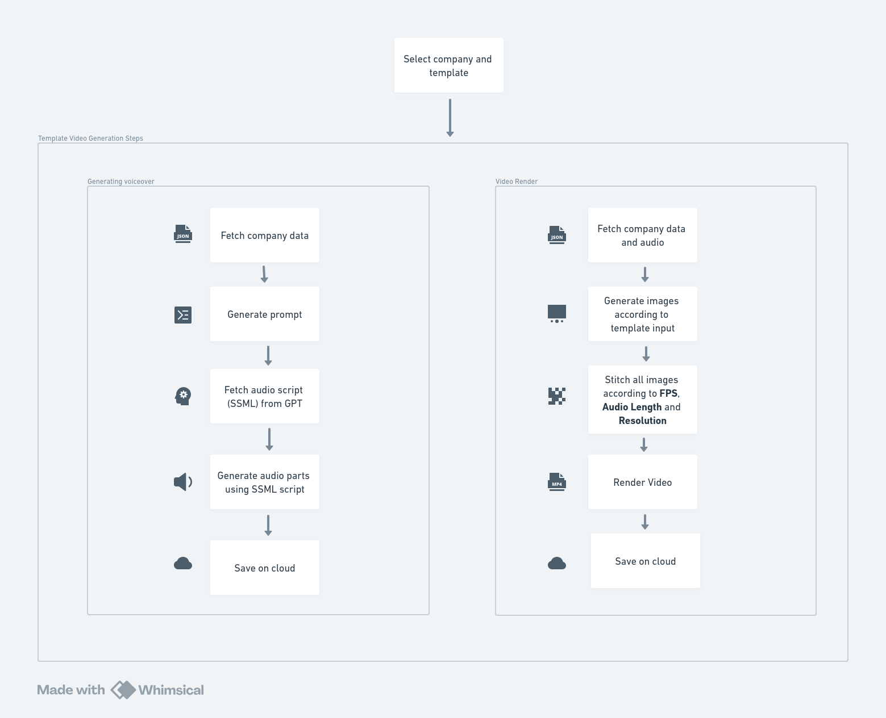
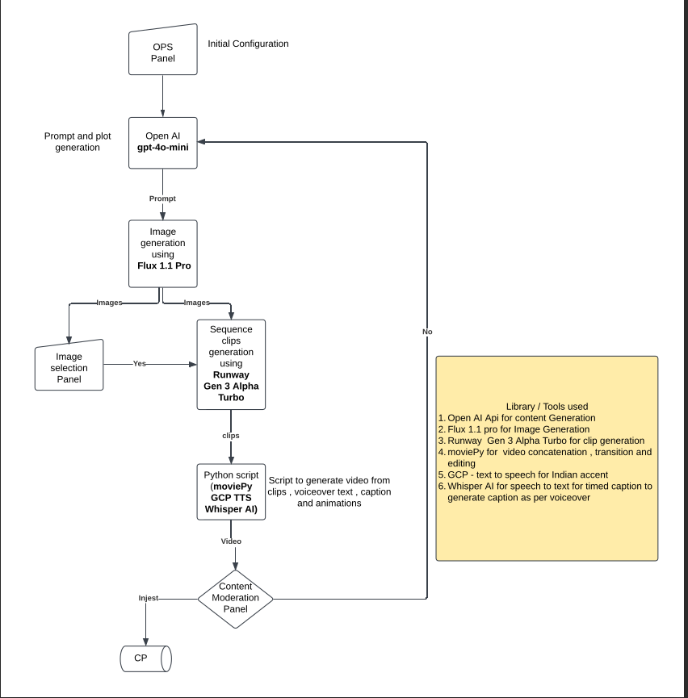

# Text to Video and Brand Video Generation

## About 

This is an AI-powered tool that can transform any topic into fully edited videos. By leveraging advanced generative AI models, we will automate the process of video production, turning written instructions, descriptions, or stories into engaging and visually appealing video content.​

## Template Video Generation Steps

## Non Templatized Video Generation Steps

### Sample template Video

## Sample Non templatized video

<!-- <video controls src="video 8.mp4" title="Title"></video> -->

## Technologies & Tools Used
Javascript, HTML, CSS, Canvas , FFMPeG, Python, GCP text to speech, GPT3.5 , Python , Open AI , Flux 1.1 pro , Runway Gen 3 Alpha , moviePy, Whisper AI 
